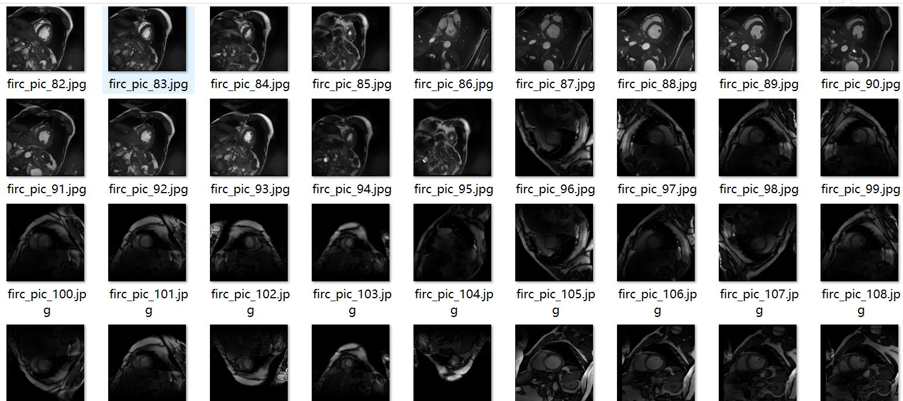
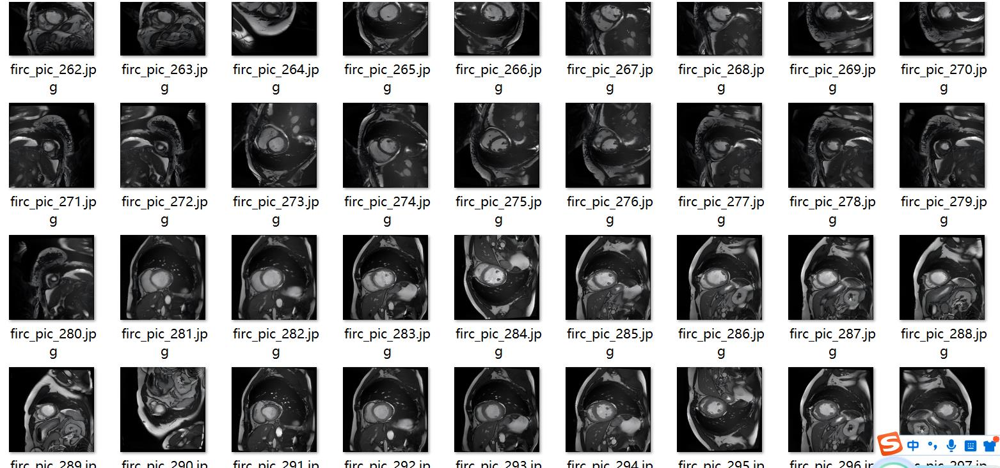
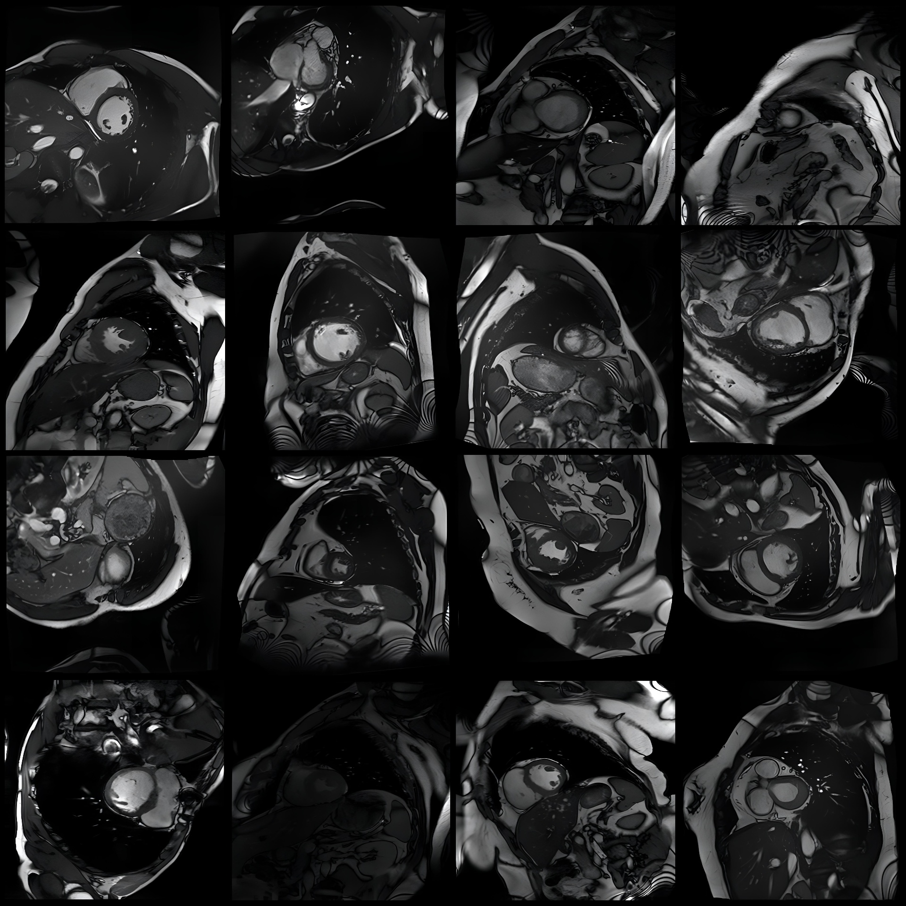
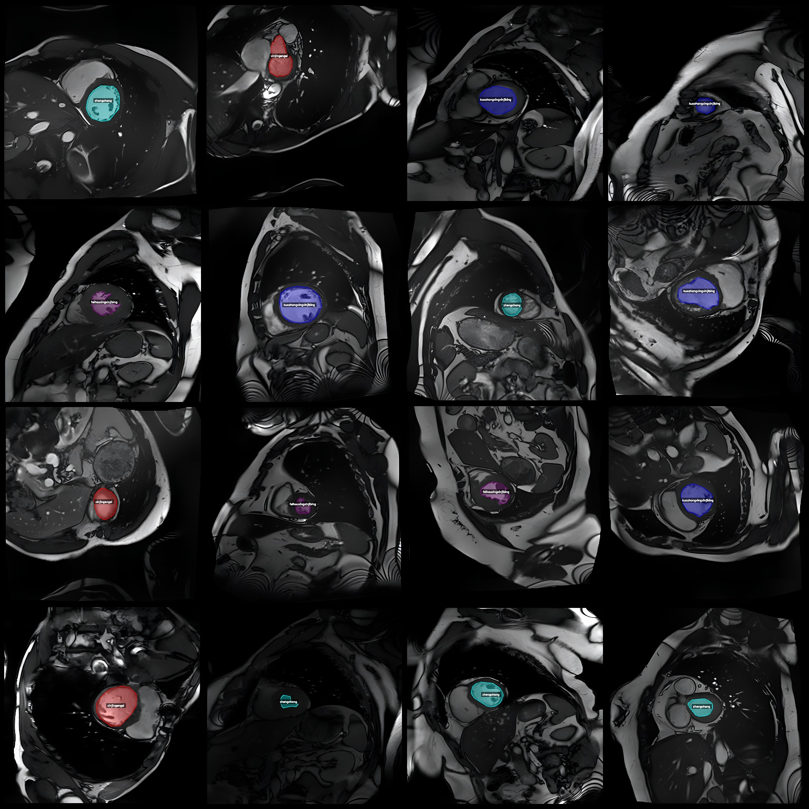
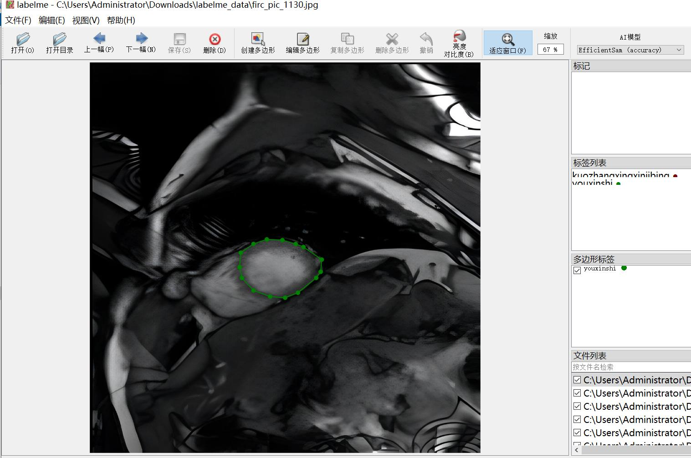

# Smart Medical ACDC Dataset: MRI Image Identification and Segmentation of Cardiac Infarction, Expansion, Myocardial Diseases, Right Ventricular Lesions in a LabelMe Format with 1147 Images and 5 
Categories

Dataset format: LabelMe format (without mask files, only including JPG images and corresponding JSON files)
Number of images (JPG file count): 1147
Number of annotations (JSON file count): 1147
Number of categories: 5
Annotation categories: ["Feihouxingxinjibing", "Kuozhangxingxinjibing", "Xinjingengsi", "Youxinshi", "Zhengchang"]
Corresponding Chinese category names: ["Hypothetically Hypertrophic Heart Disease", "Expansion Type Heart Disease", "Myocardial Infarction", "Right Ventricular Lesion", "Normal"]
Number of boxes per category:
- Feihouxingxinjibing count = 304
- Kuozhangxingxinjibing count = 329
- Xinjingengsi count = 225
- Youxinshi count = 56
- Zhengchang count = 239
Total boxes: 1153
Annotation tool used: labelme=5.5.0
Image resolution: 1280x1280
Annotation rules: Polygons are drawn for each category
Important Notice: The dataset can be opened and edited in LabelMe, but the JSON dataset needs to be converted into either Mask or Yolo format for instance segmentation or semantic segmentation.
Special Remark: This dataset does not guarantee any accuracy in the trained models or weight files.
Image previews:
Annotation examples:
Original images (randomly selected 16 images):
Annotation drawing results:
LabelMe editing image example:

## Images

Here is a pay link on Stripe ( https://buy.stripe.com/3cs8yP7sY87d0vu9AB ). Please contact me lonlonago@foxmail.com after funding $89, and I will send you a complete data files , thank you!

